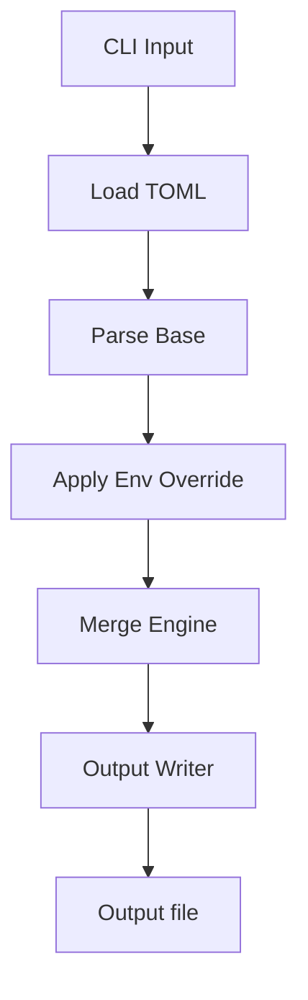
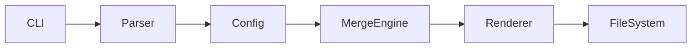

# devenv

[](https://github.com/arashrasoulzadeh/devenv/actions/workflows/go.yml)
[](https://goreportcard.com/report/github.com/arashrasoulzadeh/devenv)
[](./LICENSE)
[](https://go.dev/)

---

> **devenv** is a CLI tool for deterministic environment configuration management using TOML-based layering, now supporting output to dotenv, YAML, and TOML formats.

---

## 📖 Table of Contents

- [Overview](#-overview)
- [Installation](#-installation)
- [Quick Start](#-quick-start)
- [Commands](#-commands)
- [Help & Version](#help--version)
- [Configuration](#️-configuration)
- [How It Works](#-how-it-works)
- [Examples](#-examples)
- [Architecture](#-architecture)
- [FAQ](#-faq)
- [Contributing](#-contributing)
- [License](#-license)

---

## 🚀 Overview

**devenv** solves a simple but painful problem:

> Managing environment configs across dev, staging, and production without duplication or inconsistency.

It introduces a **layered configuration model**:

- `base` → shared defaults
- `env` → overrides
- deterministic merge → output file (dotenv, YAML, or TOML)

Now you can choose the desired output format for your config: classic `.env`, YAML, or TOML.

---

## 📦 Installation

### Homebrew (recommended)

```bash
brew install arashrasoulzadeh/tap/devenv
```

### Manual Download

Grab the latest release for your OS from the [Releases page](https://github.com/arashrasoulzadeh/devenv/releases):

```bash
curl -L https://github.com/arashrasoulzadeh/devenv/releases/latest/download/devenv-linux -o devenv
chmod +x devenv
sudo mv devenv /usr/local/bin/
```

---

## ⚡ Quick Start

### 1. Create config

```toml
[output]
name = ".env"
type = "dotenv" # can be "dotenv", "yaml", or "toml"

[base]
app_name = "devenv"
db_host = "localhost"
db_user = "root"

[dev]
db_host = "dev.internal"
db_user = "dev_user"
```

### 2. Run

```bash
devenv dev
```

### 3. Output

The output format depends on `[output.type]`:

#### Dotenv (default)
```env
app_name=devenv
db_host=dev.internal
db_user=dev_user
```

#### YAML
```yaml
app_name: "devenv"
db_host: "dev.internal"
db_user: "dev_user"
```

#### TOML
```toml
app_name = "devenv"
db_host = "dev.internal"
db_user = "dev_user"
```

---

## 🧰 Commands & CLI Usage

### Basic Usage

```
devenv [environment] [flags]
```

- `environment`: Name of the environment section to use (e.g. `dev`, `staging`, `prod`).
- Flags: See below for supported flags.

#### Common Commands

| Command                | Description                                   |
|------------------------|-----------------------------------------------|
| `devenv dev`           | Build the config for the dev environment      |
| `devenv staging`       | Build the config for the staging environment  |
| `devenv prod`          | Build the config for the prod environment     |
| `devenv help`          | Show help/usage information                   |
| `devenv version`       | Print version, build date, commit info        |

### Full CLI Help

You can always run:

```bash
devenv help
```

To see CLI help and all possible usages, which prints:

```
devenv - Deterministic Environment Configuration Manager

Usage:
  devenv [environment]

Description:
  devenv generates environment configuration files in multiple formats (dotenv, YAML, TOML)
  using a simple, layered TOML configuration.

Available Commands:
  help        Display this help message
  version     Show version and build information

Examples:
  devenv dev         # Generate config using the 'dev' environment
  devenv help        # Display this help message
  devenv version     # Print version information
```

---

## 🆘 Help & Version

### Show help

```bash
devenv help
```

- Prints a help message with usage instructions and exits.

### Show version

```bash
devenv version
```

- Prints the current version, build date, and commit hash for debugging and support.

---

## ⚙️ Configuration

### Structure

```toml
[output]
name = ".env"
type = "dotenv" # can be "dotenv", "yaml", or "toml"

[base]
# shared values

[dev]
# overrides

[prod]
# overrides
```

---

### Rules

1. Start from `[base]`
2. Apply environment override
3. Override only matching keys
4. Output as dotenv (`key=value`), YAML, or TOML

---

## 🧠 How It Works



The output format is chosen based on the `[output.type]` field in your config. Supported options: `dotenv`, `yaml`, or `toml`.
(See [`app.go`](./app.go) for how output type is handled: the tool selects `ParseTOML`, `ParseDotEnv`, or `ParseYAML` accordingly.)

---

## 💡 Examples

### Multi-environment setup

```bash
devenv dev
devenv staging
devenv prod
```

---

### CI/CD usage

```bash
devenv prod && export $(cat .env | xargs)
```

*(for YAML/TOML, use the output with compatible tools or parsers in your CI pipeline)*

---

## 🏗 Architecture



---

## ❓ FAQ

### What if a key is missing?

Falls back to `base`. If not found there → error.

### Can I add unlimited environments?

Yes.

### Is it deterministic?

Yes — same input always produces same output.

### What output formats can I use?

You can generate dotenv, YAML, or TOML outputs using `[output.type]`. The tool detects this and renders the correct format.

---

## 🤝 Contributing

PRs are welcome.

```bash
git clone https://github.com/arashrasoulzadeh/devenv
go test ./...
```

---

## 📄 License

MIT © [Arash Rasoulzadeh](https://github.com/arashrasoulzadeh)

---

## ⭐ Why devenv?

- Predictable, deterministic config layering
- Choose your output: dotenv, YAML, or TOML
- No runtime magic
- No dependency sprawl
- Just simple, portable configuration!