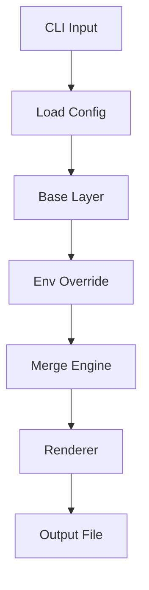
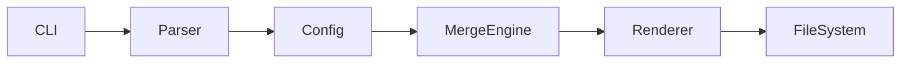

# devenv

<p align="center">
  <b>Deterministic environment configuration management — simple, predictable, and fast.</b>
</p>

<p align="center">
  <a href="https://github.com/arashrasoulzadeh/devenv/actions/workflows/go.yml">
    
  </a>
  <a href="https://goreportcard.com/report/github.com/arashrasoulzadeh/devenv">
    
  </a>
  <a href="./LICENSE">
    
  </a>
  <a href="https://go.dev/">
    
  </a>
</p>

---

## ✨ Overview

**devenv** is a modern CLI tool for managing environment configurations using a **deterministic layered model**.

No duplication. No surprises. No runtime magic.

Define your configuration once, override per environment, and generate clean output in:

- `.env`
- `YAML`
- `TOML`

---

## 🚀 Why devenv?

- 🔁 Deterministic config merging
- 🧩 Clean layering: `base → env`
- 📦 Multiple output formats
- ⚡ Fast, dependency-free CLI
- 🛠 CI/CD friendly
- 🧠 Zero magic — fully predictable

---

## 📦 Installation

### Homebrew (recommended)

```bash
brew install arashrasoulzadeh/tap/devenv
```

### Manual

```bash
curl -L https://github.com/arashrasoulzadeh/devenv/releases/latest/download/devenv-linux -o devenv
chmod +x devenv
sudo mv devenv /usr/local/bin/
```

📥 Releases: https://github.com/arashrasoulzadeh/devenv/releases

---

## ⚡ Quick Start

### 1. Create config

```toml
[output]
name = ".env"
type = "dotenv"

[base]
app_name = "devenv"
db_host = "localhost"
db_user = "root"

[dev]
db_host = "dev.internal"
db_user = "dev_user"
```

### 2. Run

```bash
devenv dev
```

### 3. Output

#### Dotenv

```env
app_name=devenv
db_host=dev.internal
db_user=dev_user
```

#### YAML

```yaml
app_name: "devenv"
db_host: "dev.internal"
db_user: "dev_user"
```

#### TOML

```toml
app_name = "devenv"
db_host = "dev.internal"
db_user = "dev_user"
```

---

## 🧰 CLI Usage

```bash
devenv [environment]
```

### Examples

```bash
devenv dev
devenv staging
devenv prod
```

### Flags

| Flag          | Description                      |
|---------------|----------------------------------|
| --config FILE | Specify custom config file path   |

You can pass flags before or after the environment name:

```bash
devenv --config myconf.toml dev
```

These flags allow you to customize the config file source and where output files are written.


### Commands

| Command            | Description                  |
|-------------------|------------------------------|
| devenv dev        | Generate dev config          |
| devenv staging    | Generate staging config      |
| devenv prod       | Generate production config   |
| devenv help       | Show help                    |
| devenv version    | Show version info            |

---

## ⚙️ Configuration

```toml
[output]
name = ".env"
type = "dotenv"

[base]
# shared values

[dev]
# overrides

[prod]
# overrides
```

### Rules

1. Load `[base]`
2. Apply environment overrides
3. Merge deterministically
4. Render output format

---

## 🧠 How It Works



---

## 💡 CI/CD Example

```bash
devenv prod && export $(cat .env | xargs)
```

---

## ❓ FAQ

**Missing key?**  
Falls back to `base`. If not found → error.

**Unlimited environments?**  
Yes.

**Deterministic?**  
Always.

**Supported formats?**  
dotenv, YAML, TOML

---

## 🏗 Architecture



---

## 🤝 Contributing

```bash
git clone https://github.com/arashrasoulzadeh/devenv
go test ./...
```

PRs welcome.

---

## 📄 License

MIT © Arash Rasoulzadeh

---

## ⭐ Star History

If you like this project, give it a ⭐ on GitHub!
