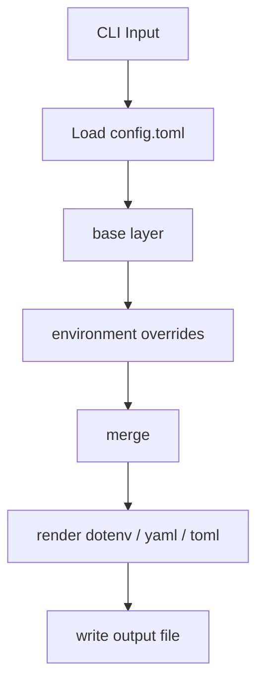

# devenv

<p align="center">
  <b>Deterministic environment configuration management — simple, predictable, and fast.</b>
</p>

<p align="center">
  <a href="https://github.com/arashrasoulzadeh/devenv/actions/workflows/go.yml">
    
  </a>
  <a href="https://goreportcard.com/report/github.com/arashrasoulzadeh/devenv">
    
  </a>
<a href="https://app.fossa.com/projects/git%2Bgithub.com%2Farashrasoulzadeh%2Fdevenv?ref=badge_shield" alt="FOSSA Status"></a>
  <a href="./LICENSE">
    
  </a>
  <a href="https://go.dev/">
    
  </a>
</p>

---


[](https://app.fossa.com/projects/git%2Bgithub.com%2Farashrasoulzadeh%2Fdevenv?ref=badge_large)

## Overview

**devenv** is a CLI tool for managing environment configurations using a layered TOML config.

Define shared values in `[base]`, add per-environment overrides, and generate a clean output file in dotenv, YAML, or TOML format. No duplication, no surprises.

---

## Installation

### Homebrew

```bash
brew install arashrasoulzadeh/tap/devenv
```

### Manual

```bash
curl -L https://github.com/arashrasoulzadeh/devenv/releases/latest/download/devenv-linux -o devenv
chmod +x devenv
sudo mv devenv /usr/local/bin/
```

Releases: https://github.com/arashrasoulzadeh/devenv/releases

---

## Quick Start

### 1. Create `config.toml`

```toml
[output]
name = ".env"
type = "dotenv"

[base]
app_name = "myapp"
db_host  = "localhost"
db_user  = "root"

[dev]
db_host = "dev.internal"
db_user = "dev_user"

[prod]
db_host = "db.prod.internal"
db_user = "prod_user"
```

### 2. Generate the config file

```bash
devenv dev
```

### 3. Output (dotenv)

```env
app_name="myapp"
db_host="dev.internal"
db_user="dev_user"
```

The same config with `type = "yaml"`:

```yaml
app_name: "myapp"
db_host: "dev.internal"
db_user: "dev_user"
```

Or `type = "toml"`:

```toml
app_name = "myapp"
db_host = "dev.internal"
db_user = "dev_user"
```

---

## CLI Reference

### Generate a config file

```bash
devenv [environment]
```

Merges `[base]` with the named environment section and writes the output file.

```bash
devenv dev      # merge base + [dev], write output
devenv staging  # merge base + [staging], write output
devenv prod     # merge base + [prod], write output
devenv          # write base only (no overlay)
```

### Check missing environment variables

```bash
devenv env <environment> [--no-values]
```

Compares the merged config for the given environment against your current OS environment and reports any keys that are not set.

```bash
devenv env dev              # show missing keys with their values
devenv env prod --no-values # show missing keys without exposing values
```

### Other commands

| Command          | Description                     |
| ---------------- | ------------------------------- |
| `devenv help`    | Show help                       |
| `devenv version` | Show version and build metadata |

### Flags

| Flag            | Description                                                 |
| --------------- | ----------------------------------------------------------- |
| `--config FILE` | Use a custom config file path (default: `config.toml`)      |
| `--dont-commit` | Dry-run: merge and validate without writing the output file |
| `--no-values`   | Hide values in the missing-keys report (use with `env`)     |
| `--percent`     | show a message with percent of not exists config in env     |
| `--json`        | flush messages of log as JSON                               |
| `--color`       | colorize text output                                        |

- logs and outputs are flushed on defer.

```bash
devenv --config path/to/myconf.toml dev
devenv dev --dont-commit
devenv env prod --no-values
```

---

## Configuration

```toml
[output]
name = ".env"       # output file name
type = "dotenv"     # dotenv | yaml | toml

[base]
# shared defaults applied to every environment

[dev]
# keys here override [base] for: devenv dev

[prod]
# keys here override [base] for: devenv prod
```

Merge rules:

1. Load `[base]`
2. Apply the selected environment's overrides (environment keys win over base)
3. Render to the configured output format
4. Write to `output.name`

---

## How It Works


```mermaid
flowchart TD
    A[CLI Input] --> B[Load config.toml]
    B --> C[base layer]
    C --> D[environment overrides]
    D --> E[merge]
    E --> F[render dotenv / yaml / toml]
    F --> G[write output file]
```

---

## CI/CD

```bash
devenv prod && export $(cat .env | xargs)
```

---

## FAQ

**Can I define unlimited environments?**
Yes — any TOML section that is not `[base]` or `[output]` is treated as an environment.

**What output formats are supported?**
`dotenv`, `yaml`, and `toml`.

**Is the output deterministic?**
Yes. Keys are always sorted alphabetically, so the file is stable across runs.

**What happens if a key only exists in `[base]` and not in the selected environment?**
It is included as-is from `[base]`.

---

## Contributing

```bash
git clone https://github.com/arashrasoulzadeh/devenv
go test ./...
```

PRs welcome.

---

## License

MIT © Arash Rasoulzadeh